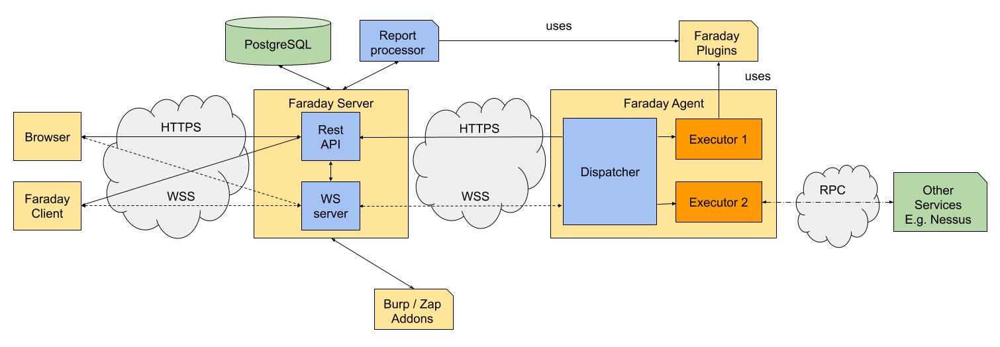

# Architecture overview

This page provides a high level overview Faraday and the role of its components. 

# Technical introduction 

Faraday is a web application, the [Server][server] is made with python using Flask and the [Frontend][frontend] is made 
with ReactJS. It is deployed as a standard WSGI application. Its possible to interact with the Server with 
[Faraday client][faraday_client] and you can automatize tool usage with [Faraday agent][faraday_agent].




# Faraday Server


Faraday uses PostgreSQL as a database engine.
The Server provides everything else using a REST API. You can also make queries over
the relational database structured according to our Host/Services/Vulnerability models (server/models.py). Our
Server acts as a Web Server build upon Twisted which provides websockets, wsgi and serves static files.

# Faraday Client 

[Faraday client][faraday_client] provides an interface for interacting with a terminal that allows the user to execute commands which results will be loaded inside Faraday Server. 
The Client also allows the user to upload tool reports, create workspaces and configure [Faraday Plugins][faraday_plugins]

# Faraday Server 

Faraday is accessed by a Web Browser or the [Faraday Client](#faraday-client). Both clients communicate with Faraday Server via its [REST API][api_docs]. 

The data is persisted within a PostgreSQL database, processed with python libraries as SQLAlchemy and Marshmallow.

The server has other main components as the Report Processor, or the Websocket Server. The latter provides information to the Client, and the [Agents](#faraday-agent).

# Faraday Agent 

The Faraday Agents allows to automate the upload of different data to the server, such as integration with other applications or services; or execute some tools that the [Faraday plugins][faraday_plugins] can process. Moreover, the Agents can be executed on any remote computer and its Executors can be written in any language.

# Burp / Zap Addons

Faraday has [Burp][burp_addon]/[Zap][zap_addon] Extensions that run inside the third party application. Using Faraday addons provides flexibility to ingress information inside Faraday Server from other applications.


# Appendix

## Database schema

Faraday manage command can generate the current database schema with:

```
faraday-manage database-schema
```


[frontend]: link al github del frontend
[server]: https://github.com/infobyte/faraday
[faraday_client]: https://github.com/infobyte/faraday-client
[faraday_agent]: https://github.com/infobyte/faraday_agent_dispatcher
[api_docs]: https://apidocs.faradaysec.com
[faraday_plugins]: https://github.com/infobyte/faraday_plugins
[burp_addon]: https://github.com/infobyte/faraday_burp
[zap_addon]: https://github.com/infobyte/faraday_zap